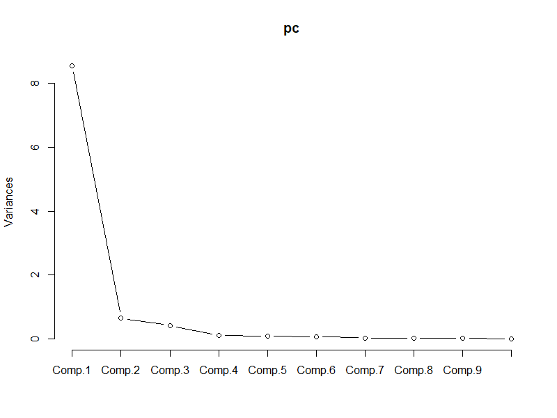

# Principal Component Analysis of Bird Skeletal Measurements

## Project Overview
This project applies **Principal Component Analysis (PCA)** in R to explore the underlying structure of bird skeletal measurements and to examine how bone morphology relates to different ecological groups of birds.

The analysis demonstrates how dimensionality reduction can be used to summarize complex biological data while retaining most of its variability.

## Scientific Context
Birds belonging to different ecological groups exhibit distinct physical characteristics:
- Flying birds have strong wings
- Wading birds have long legs
- Raptors possess robust skeletal structures

These ecological adaptations are reflected in the **lengths and diameters of their bones**.  
PCA is used to uncover latent patterns in skeletal measurements and to summarize them into a small number of meaningful components.

## Objectives
1. Explore correlations among skeletal measurements  
2. Reduce data dimensionality using Principal Component Analysis  
3. Identify the number of principal components explaining most of the variance  
4. Interpret principal components in a biological and ecological context  
5. Compare PCA-derived scores across bird ecological groups  

## Dataset
The dataset (`Bird.csv`) is included in the repository and contains skeletal measurements of birds from museum collections.

### Dataset Description
Each bird is described by **10 continuous variables (in mm)**:
- Length and diameter of:
  - Humerus
  - Ulna
  - Femur
  - Tibiotarsus
  - Tarsometatarsus

Ecological group labels:
- `SW` — Swimming Birds  
- `W` — Wading Birds  
- `T` — Terrestrial Birds  
- `R` — Raptors  
- `P` — Scansorial Birds  
- `SO` — Singing Birds  

## Analysis Workflow
1. Data import and validation  
2. Correlation analysis and exploratory visualization  
3. Feature scaling and standardization  
4. Principal Component Analysis  
5. Evaluation of explained variance  
6. Interpretation of component loadings  
7. Creation of PCA-based performance scores  
8. Comparison of ecological groups using PCA scores  

## Methods and Techniques
- Exploratory data analysis
- Correlation analysis
- Feature scaling
- Principal Component Analysis
- Scree plot interpretation
- Group-wise summary statistics
- Data visualization

## Key Findings
- Skeletal measurements are **strongly positively correlated**
- The **first principal component explains ~85% of the total variance**
- The **first two principal components explain ~92% of the variance**
- Dimensionality reduction from 10 variables to 2 components preserves most information
- Raptors exhibit the **highest average PCA-based performance score**, reflecting stronger skeletal structures

## Visualization

## Tools and Skills
- R
- Principal Component Analysis (PCA)
- Dimensionality reduction
- Multivariate data analysis
- Biological data interpretation
- Data visualization

## How to Run the Project
1. Clone the repository  
2. Open the R script  
3. Ensure the dataset (`Bird.csv`) is located in the root directory  
4. Run the script sequentially  

## Notes
This project was completed for educational purposes and demonstrates the application of PCA to real-world biological data for dimensionality reduction and pattern discovery.
